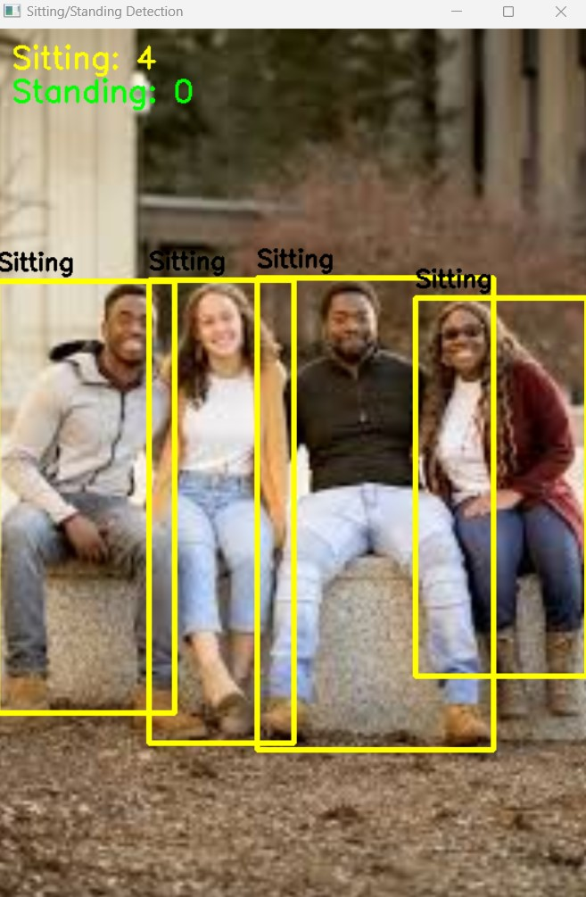
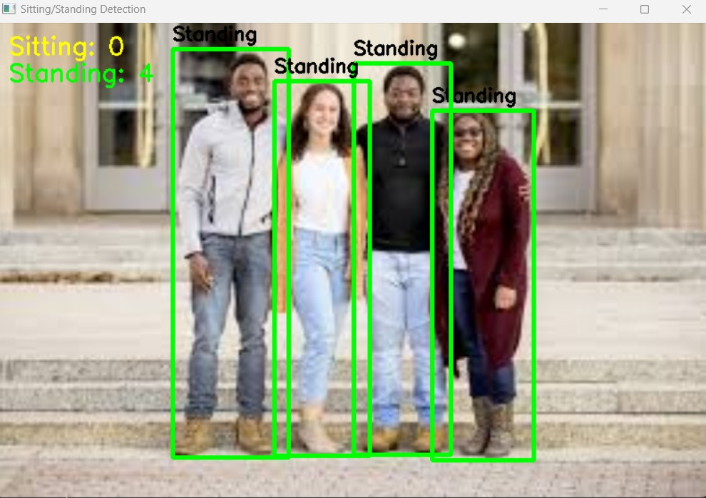
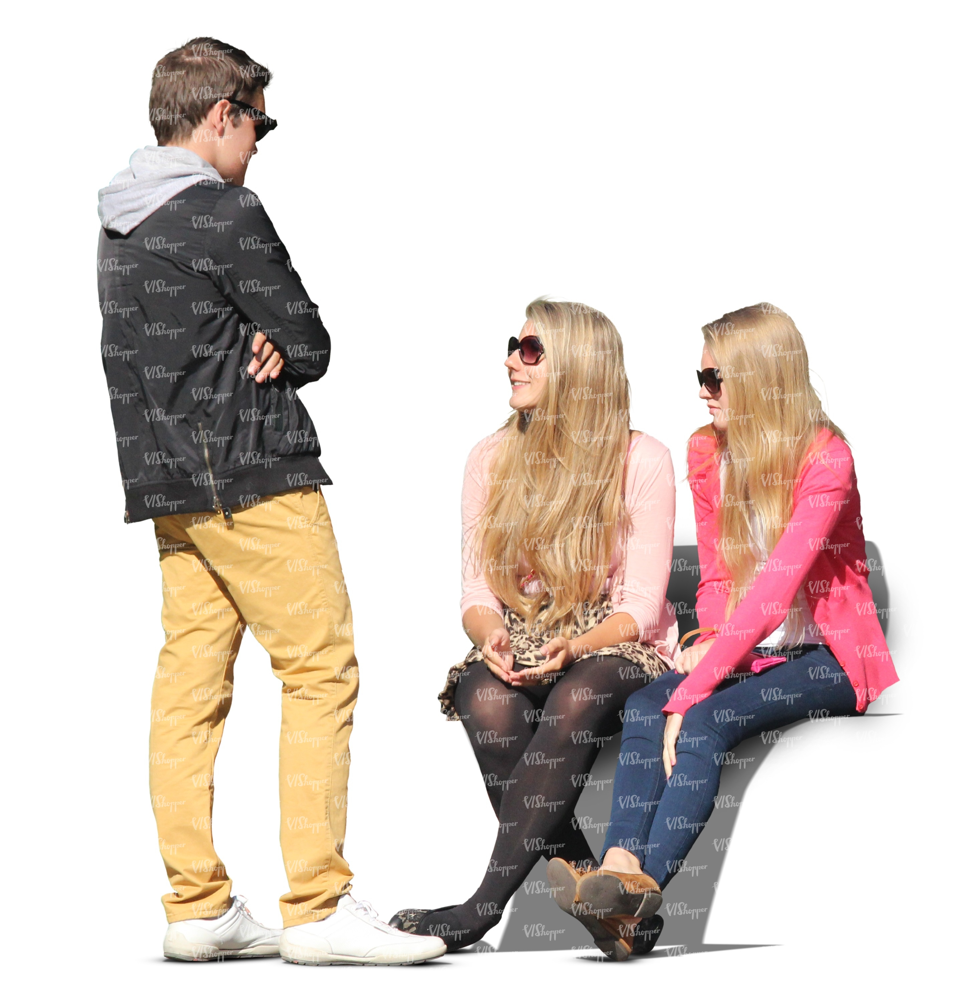
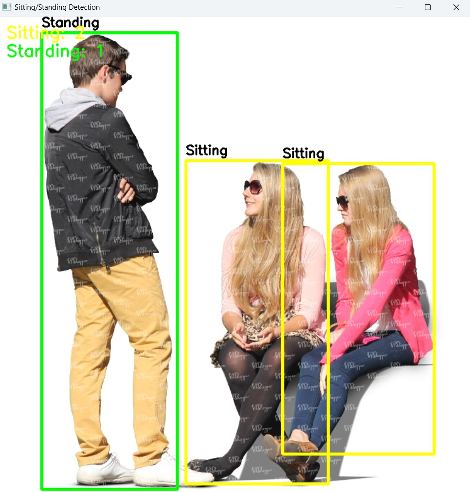

# 🧍 Pose Detection: Sitting vs Standing

A computer vision project for detecting whether people are **sitting** or **standing** in images, videos, and live webcam streams using **YOLOv8** and **MediaPipe Pose**.

<p align="center">
  
  <br>
  <em>Real-time Sitting and Standing Detection</em>
</p>

---

## 🖼️ Sample Results

| Original                                 | Detection                                       |
| ---------------------------------------- | ----------------------------------------------- |
|  |  |
|  |  |
|  |  |

---

## 🚀 Features

✅ Detect multiple people in a scene

✅ Classify each person as:

* 🪑 Sitting
* 🚶 Standing

✅ Real-time webcam support

✅ Video file processing

✅ Image-based pose detection

✅ Person tracking across frames

✅ Temporal smoothing to reduce flickering predictions

✅ Live statistics for sitting and standing counts

---

## 🛠️ Technologies Used

* 🐍 Python
* 👁️ OpenCV
* 🎯 YOLOv8 (Person Detection)
* 🦴 MediaPipe Pose
* 🔢 NumPy

---

## 🐍 Environment

- Python 3.10.11

---

## 📂 Project Structure

```text
Pose-Detection/
│
├── Vision_pose_detection_img.ipynb
├── vision_pose_detection.ipynb
├── assets/
│   ├── demo.gif
│   │
│   ├── test1.jpg
│   ├── test1_output.jpg
│   │
│   ├── test2.jpg
│   ├── test2_output.jpg
│   │
│   ├── test3.jpg
│   └── test3_output.jpg
│
├── README.md
├── requirements.txt
└── .gitignore
```

---

## ⚙️ Installation

Clone the repository:

```bash
git clone https://github.com/melofy-vibes/pose-detection.git
cd pose-detection
```

Install dependencies:

```bash
python==3.10.11
pip install -r requirements.txt
```

---

## 📸 Image Detection

Run:

```bash
Vision_pose_detection_img.ipynb
```

The notebook:

1. Detects people using YOLOv8
2. Extracts body landmarks with MediaPipe
3. Calculates pose geometry
4. Classifies each person as Sitting or Standing
5. Displays counts on the image

---

## 🎥 Video & Webcam Detection

Run:

```bash
vision_pose_detection.ipynb
```

Supports:

* Webcam (`VIDEO_PATH = 0`)
* Video files

Features:

* Person tracking using IoU matching
* Temporal state smoothing
* Stable pose classification
* Real-time visualization

---

## 🧠 Detection Logic

The classification is based on body geometry:

### Knee Angle

Smaller knee angles typically indicate a sitting posture.

### Hip-to-Knee Ratio

The relative position of the hip, shoulder, knee, and ankle helps distinguish sitting from standing.

The final decision combines these geometric features with temporal filtering for improved stability.

---

## 📊 Example Output

| ID | State       |
| -- | ----------- |
| 0  | 🚶 Standing |
| 1  | 🪑 Sitting  |
| 2  | 🚶 Standing |

Counts:

```text
Sitting: 1
Standing: 2
```

---

## 🎯 Future Improvements

* 🔥 Fine-tune thresholds automatically
* 🚨 Fall detection support
* 🏃 Additional pose classes (walking, running, lying down)
* ⚡ GPU optimization

---

## 👩‍💻 Author

Developed by Mehraveh as a computer vision project combining object detection, pose estimation, and real-time tracking.
